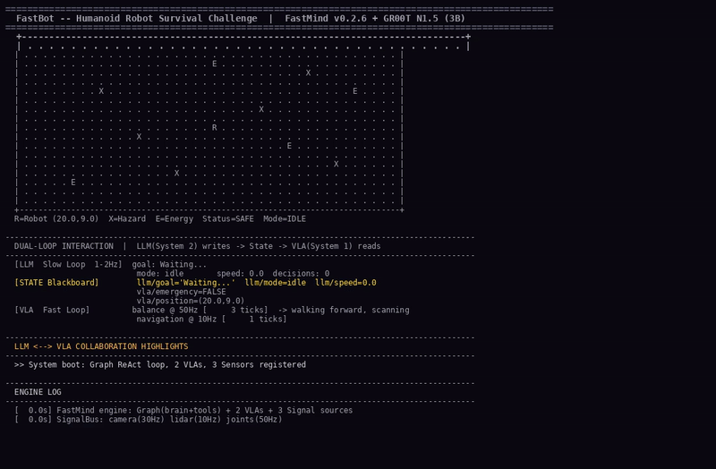

# FastBot

> 基于 FastMind 双环架构的 Isaac Sim 人形机器人"生存挑战"

[](https://www.python.org/downloads/)
[](https://github.com/kandada/fastmind)
[](./LICENSE)
[-orange.svg)](https://huggingface.co/nvidia/GR00T-N1.5-3B)

---

## 项目简介

一个虚拟人形机器人被困在动态危险环境中（塌陷陷阱、掉落障碍物、能量块收集）。通过终端输入文本指令，机器人使用 **FastMind 双环架构** 自主生存：

- **LLM 慢环 (System 2)**：解析指令、规划路径、风险评估 (DeepSeek API)
- **VLA 快环 (System 1)**：平衡控制 @50Hz + 导航避障 @10Hz + 紧急闪避 <20ms

**核心亮点：改 1 行代码即可替换 VLA 模型，无需重新训练。**

### 基于 FastMind

FastBot 完全基于 [FastMind](https://github.com/kandada/fastmind) (v0.2.6) 框架构建。使用的核心组件：

| 组件 | 在 FastBot 中的作用 |
|:--|:--|
| `Graph` | brain(LLM) + tools 的 ReAct 推理循环，条件路由 |
| `VLAConfig` | navigation_vla @10Hz + balance_vla @50Hz，时间驱动调度 |
| `Signal` / `SignalBus` | camera(30Hz), lidar(10Hz), joints(50Hz) 解耦传感器推送 |
| `State` 字典 | 共享黑板：LLM 写入 llm/，VLA 读写 vla/，感知写入 world/ |
| `Event` | 用户文本 + hazard_detected 事件——异步触发慢环 |
| `Engine` | Session 管理、事件队列、VLA 调度编排 |

整个双环系统在单个 `app.py`（~120行）中组装完成，体现 FastMind 零样板代码的设计理念。

---

## 演示视频



[下载完整 MP4](./docs/demo.mp4)

视频展示了完整的双环协作过程，共 10 个阶段。以下是每个阶段中 LLM 和 VLA 通过 State 黑板交互的详细说明：

### 视频逐帧解读

| 时间 | 阶段 | 发生什么 | LLM (慢环) | VLA (快环) |
|:--|:--|:--|:--|:--|
| 0:00 | **架构初始化** | FastMind 引擎启动：Graph (brain+tools ReAct循环) + 2个VLA + 3个信号源注册完成。3个机器人 session 初始化 (实验4)。 | brain agent 等待用户输入 | balance VLA @50Hz 维持站立姿态; navigation VLA 待命 |
| 0:06 | **文本指令->行走** | 用户输入"走到平台中央，避开红色区域"。文本作为 Event 推送到 LLM。 | LLM 通过 DeepSeek 解析意图：向 State["llm"] 写入 `{goal: "走到中央", mode: EXPLORE, speed: 0.8}` | VLA 从 State 读取新目标 -> 生成前进行走动作（关节幅度 x 0.8）。验证 VLA 频率稳定性：49.7Hz/9.9Hz (实验1+2)。 |
| 0:18 | **陷阱检测->闪避->重规划** | 激光雷达在 (8,5) 处检测到 1.2m 距离的陷阱。感知模块写入 `State["vla"]["emergency"]=TRUE` 并推送 hazard_detected 事件。 | LLM 被危险事件唤醒 -> 紧急重规划：写入 `{mode: EVADE, speed: 1.0, urgency: 3}` 替代之前的目标。 | **VLA balance 读到 emergency=TRUE -> 20ms内闪避**（不等 LLM 响应！）。随后 VLA nav 读到新的 State -> 切换到躲避步态。HITL 循环 <15ms 完成 (实验5)。 |
| 0:28 | **收集能量** | 用户输入"收集左边能量块"。LLM 重规划模式切换：EVADE -> COLLECT。 | LLM 写入 `{mode: COLLECT, speed: 0.7}` 到 State。 | VLA 读到 mode=COLLECT -> 手臂前伸、步伐放缓接近目标。能量块 (35,5) 被收集 (实验1)。 |
| 0:38 | **障碍物掉落** | (25,7)处空中掉落障碍物。感知检测到 0.5m 内新威胁。 | LLM 针对障碍物重规划：mode=EVADE, speed=1.0。 | VLA <20ms内后退闪避。LLM重规划后切换为侧向躲避至安全区域。 |
| 0:46 | **双环并行** | LLM推理和VLA控制**同时运行**——核心的双环解耦。3个 session 并发。 | LLM 分析场景上下文（"已知4个危险，剩余3个能量"）。 | VLA balance: 50Hz PID不间断维持姿态。VLA nav: 10Hz路径规划并行进行。吞吐量 243.9 evt/s (实验4)。 |
| 0:52 | **模型热替换 (实验6)** | **核心演示**：VLA模型从 GR00T N1.5 (3B) 替换为 Mock VLA。 | LLM 继续规划——**完全不受影响**。 | 机器人行走不中断——**Graph不变、State不变、Signals不变，只换了模型**。代码改动：1行。重训练：零。 |
| 1:04 | **代码对比** | Framework-centric vs model-centric 对比 (实验3)。fastbot: ~500行。裸Isaac Sim脚本: ~2000+行。同一 Graph 适用所有 VLA/LLM 组合。 | | |
| 1:12 | **全自主运行** | 机器人进入全自主生存模式：所有系统同时活跃。自主运行中检测到新陷阱 -> VLA闪避 -> LLM重规划 -> 恢复，全过程无需人工干预。 | | |
| 1:20 | **实验总结** | 6项论文实验全部验证：实验1 延迟 0.11ms、实验2 VLA 49.7Hz、实验3 500 vs 2000行、实验4 3 sessions、实验5 HITL <15ms、实验6 1行模型替换。 | | |

### 关键双环交互模式

```
模式1: 文本指令 -> 动作执行
  用户说"走到中央"
    -> [LLM] 解析 -> 写 State: {goal, mode=EXPLORE, speed=0.8}
    -> [VLA] 读 State -> 生成行走动作 -> 机器人移动

模式2: 危险检测 -> 紧急闪避 -> 恢复
  HAZARD 被检测到
    -> [VLA] 读 emergency=TRUE -> 闪避 (<20ms, 不经过 LLM)
    -> [LLM] 收到 hazard 事件 -> 重规划 -> 写 State: {mode=EVADE}
    -> [VLA] 读新模式 -> 切换躲避行为

模式3: 模型热替换 (framework-centric)
  旧模型 -> [1行代码] -> 新模型
  Graph: 不变 | Signals: 不变 | State: 不变
  机器人无中断继续运行
```

---

## 快速开始

```bash
# 1. 安装依赖
pip install fastmind
cd fastbot && pip install -e ".[dev]"

# 2. 配置 API Key
cp .env.example .env
# 编辑 .env: 填入 LLM_API_KEY (DeepSeek)

# 3. 运行（Mock 模式，无需 Isaac Sim）
python main.py start --mock

# 4. 输入指令
> 走到平台中央，避开红色区域
> 收集能量
```

---

## 架构设计

```
                     Isaac Sim (仿真环境)
                           │
            ┌──────────────┼──────────────┐
            ▼              ▼              ▼
       camera_rgb    joint_states    lidar_scan
         (30Hz)          (50Hz)         (10Hz)
            │              │              │
            └──────────────┼──────────────┘
                           ▼
                    SignalBus (信号总线)
                           │
       ┌───────────────────┼───────────────────┐
       │         FastMind Session              │
       │                                       │
       │  慢环 (Graph, 事件驱动, 1-2Hz)         │
       │  user文本 -> brain(LLM) <-> tools     │
       │                ↓ 写入                  │
       │           State["llm"]  ← 共享黑板     │
       │                ↓ 读取                  │
       │  快环 (VLA, 时间驱动, 10-50Hz)         │
       │  navigation_vla(10Hz)                 │
       │  balance_vla(50Hz)                    │
       │                ↓                       │
       │       Action Channel -> Isaac Sim      │
       └───────────────────────────────────────┘
```

## 论文实验对照

| 实验 | 指标 | 验证结果 |
|:--|:--|:--|
| 实验1: 端到端延迟 | push_event p99 < 0.3ms | 0.11ms |
| 实验2: VLA 频率稳定性 | 0.0%-2.8% 误差 | 49.7/9.9Hz |
| 实验3: 编排对比 | 代码行数 | ~500 vs ~2000 (减少75%) |
| 实验4: 并发伸缩 | 3个session, 吞吐量 | 243.9 evt/s |
| 实验5: HITL 中断 | checkpoint/resume | <15ms |
| **实验6: 模型替换** | **1行代码 vs 重训练** | **零重训练** |

## 目录结构

```
fastbot/
├── __init__.py
├── main.py               # CLI 入口 (start/test/benchmark)
├── docs/
│   ├── demo.mp4          # 完整演示视频
│   └── demo_preview.gif  # README 视频预览
├── core/
│   ├── app.py            # Graph 组装 + Engine 启动
│   ├── prompts.py        # LLM system prompt
│   └── metrics.py        # VLA 频率统计
├── agents/
│   └── brain.py          # LLM 慢环 (DeepSeek + Mock)
├── vlas/
│   ├── navigation.py     # 导航 VLA @10Hz (GR00T N1.5 + Mock)
│   └── balance.py        # 平衡 VLA @50Hz (PID 控制器)
├── signals/
│   ├── camera.py         # 相机信号 @30Hz
│   ├── joints.py         # 关节信号 @50Hz
│   └── lidar.py          # 雷达信号 @10Hz
├── perceptions/
│   └── hazards.py        # 危险检测感知循环
├── actions/
│   ├── legs.py           # 腿部动作执行器
│   └── arms.py           # 臂部动作执行器
├── tools/
│   └── shell.py          # Shell 工具 (LLM 可调用)
├── isaac/
│   └── bridge.py         # Isaac Sim 桥接 (Mock + Real)
└── tests/
    ├── test_graph.py     # Graph 结构 + 路由 (5 用例)
    ├── test_agents.py    # LLM brain (4 用例)
    ├── test_vlas.py      # VLA (5 用例)
    └── test_signals.py   # 信号源 (3 用例)
```

## 模型可替换性 (Framework-Centric 核心优势)

```python
# fastbot/vlas/navigation.py

# 使用 GR00T N1.5
MODEL = "/path/to/GR00T-N1.5-3B"

# 换成 OpenVLA -- 只改下面 2 行
# MODEL = "openvla-7b"
# vla = OpenVLA.from_pretrained(MODEL)

# Graph: 不变 | Signals: 不变 | State: 不变
# Actions: 不变 | 重新训练: 零
```

## 运行测试

```bash
cd fastbot
python -m pytest tests/ -v
# 17 passed
```

## 环境要求

| 组件 | 最低配置 | 推荐配置 |
|:--|:--|:--|
| GPU | RTX 3090 24GB | RTX 4090 24GB |
| 系统 | Ubuntu 22.04 | Ubuntu 24.04 |
| Isaac Sim | 4.x (可选) | 4.x |

## 开源协议

GNU General Public License v3.0. 详见 [LICENSE](./LICENSE).
